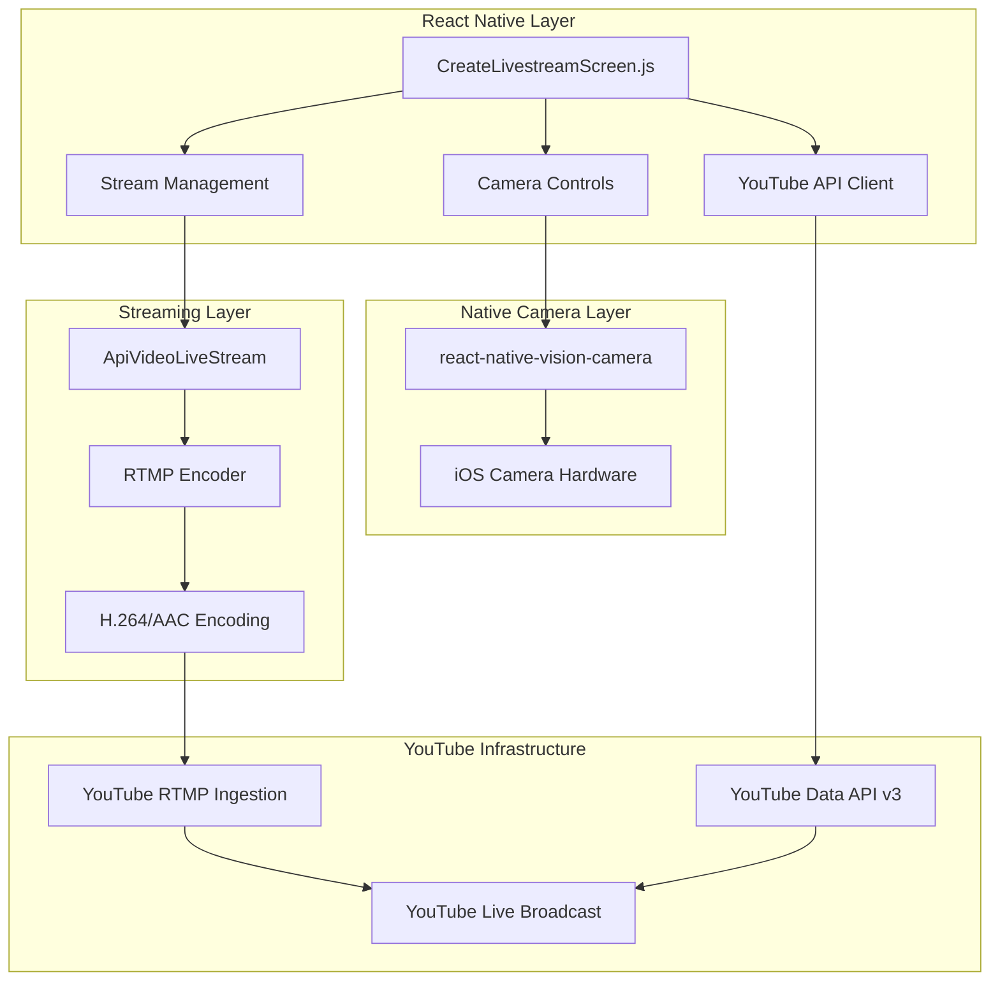
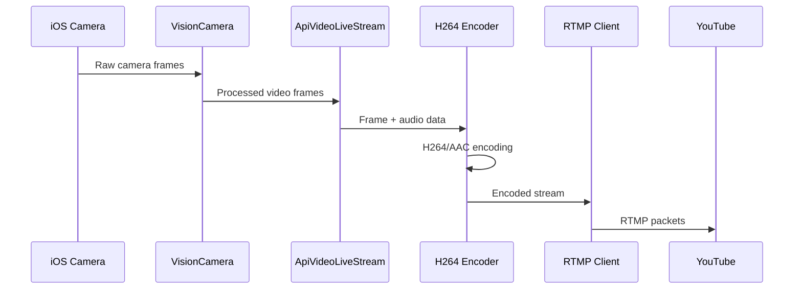
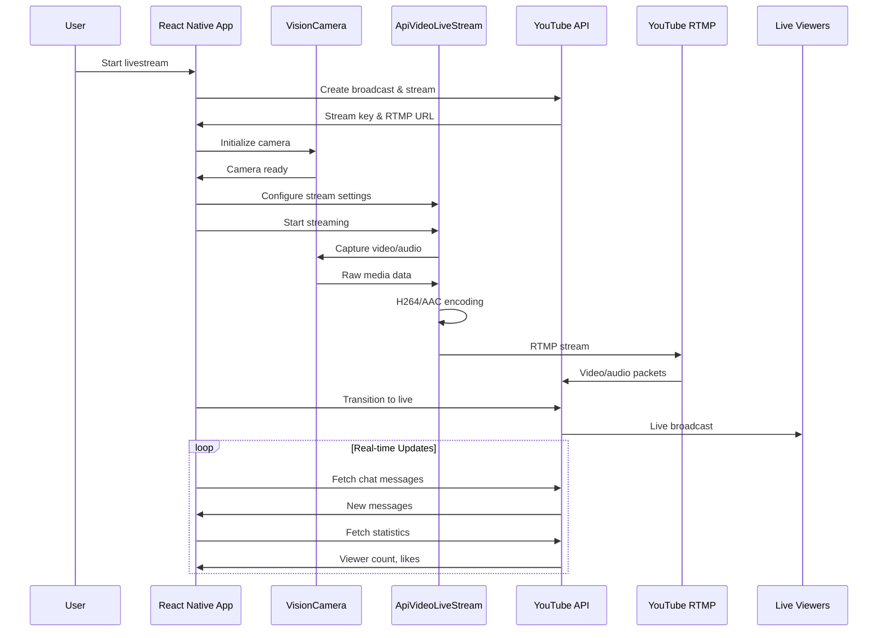

# StreamVerse - Technical Architecture Documentation

## 🎯 Overview

This document explains the technical architecture and implementation details of our iOS livestreaming application. We built a professional-grade RTMP streaming solution that integrates directly with YouTube Live using React Native.

## 📋 Table of Contents

- [🏗️ System Architecture](#️-system-architecture)
- [📱 Camera Implementation](#-camera-implementation)
- [🎥 Video Encoding Pipeline](#-video-encoding-pipeline)
- [📡 RTMP Streaming](#-rtmp-streaming)
- [🔴 YouTube Integration](#-youtube-integration)
- [💬 Real-time Chat](#-real-time-chat)
- [🔧 Module Dependencies](#-module-dependencies)
- [⚙️ Configuration](#️-configuration)
- [🔄 Data Flow](#-data-flow)
- [🐛 Implementation Challenges](#-implementation-challenges)

## 🏗️ System Architecture

### Core Components



### Technology Stack

| Layer | Technology | Purpose |
|-------|------------|---------|
| **UI Framework** | React Native 0.73 | Cross-platform mobile development |
| **Camera Engine** | `react-native-vision-camera` v3 | Modern camera API with full iOS support |
| **Streaming Engine** | `@api.video/react-native-livestream` | RTMP encoding and streaming |
| **Authentication** | Google OAuth 2.0 | YouTube API access |
| **State Management** | React Hooks + Context | Application state |

## 📱 Camera Implementation

### Module: `react-native-vision-camera`

We chose this over the deprecated React Native Camera because:
- **Modern API**: Uses the latest iOS camera frameworks
- **iPhone 16 Support**: Full compatibility with newest devices
- **Performance**: Hardware-accelerated processing
- **Flexibility**: Granular control over camera settings

### Implementation Details

```javascript
// Camera device selection with fallback
const device = useCameraDevice(isFrontCamera ? 'front' : 'back');
const fallbackDevice = useCameraDevice(isFrontCamera ? 'back' : 'front');
const selectedDevice = device || fallbackDevice;

// Camera component with streaming integration
<Camera
  ref={cameraRef}
  style={StyleSheet.absoluteFill}
  device={selectedDevice}
  isActive={currentStep === 'preview'}
  photo={true}
  video={true}
  audio={!isMicMuted}
  torch={flash === 'on' ? 'on' : 'off'}
/>
```

### Camera State Management

```javascript
const cameraStates = {
  INITIALIZING: 'Requesting permissions and setting up camera',
  READY: 'Camera ready for preview',
  STREAMING: 'Actively streaming to YouTube',
  PAUSED: 'Camera paused (privacy mode)',
  ERROR: 'Camera error or permission denied'
};
```

### Privacy Protection

```javascript
// Automatic camera disable when app backgrounds
useEffect(() => {
  const handleAppStateChange = (nextAppState) => {
    if (appState.match(/active/) && nextAppState === 'background') {
      if (isStreaming || currentStep === 'live' || currentStep === 'preview') {
        setIsCameraOff(true);
        Alert.alert('🔒 Privacy Protection', 'Camera disabled for privacy');
      }
    }
  };
  
  const subscription = AppState.addEventListener('change', handleAppStateChange);
  return () => subscription?.remove();
}, [appState, isStreaming, currentStep]);
```

## 🎥 Video Encoding Pipeline

### Module: @api.video/react-native-livestream

This module handles the complex video encoding and RTMP streaming:

```javascript
<ApiVideoLiveStreamView
  ref={liveStreamRef}
  style={StyleSheet.absoluteFill}
  camera={isCameraOff ? null : (isFrontCamera ? 'front' : 'back')}
  enablePinchedZoom={!isCameraOff}
  video={{
    fps: 30,
    resolution: streamQuality, // '480p', '720p', '1080p'
    bitrate: streamBitrate * 1000, // Convert kbps to bps
    gopDuration: 2, // GOP duration for YouTube
  }}
  audio={{
    bitrate: 128000, // 128 kbps
    sampleRate: 44100, // 44.1 kHz
    isStereo: true,
  }}
  isMuted={isMicMuted}
/>
```

### Encoding Configuration

| Quality | Resolution | Video Bitrate | Audio Bitrate | Use Case |
|---------|------------|---------------|---------------|----------|
| Mobile | 480p | 1.5 Mbps | 128 kbps | Low bandwidth |
| Standard | 720p | 2.5 Mbps | 128 kbps | Normal streaming |
| High | 1080p | 4.5 Mbps | 128 kbps | High quality |

### Video Processing Flow



## 📡 RTMP Streaming

### Stream Initialization

```javascript
const startLiveStreaming = async () => {
  try {
    // Wait for component readiness
    while (!liveStreamRef.current?._isReady && attempts < maxAttempts) {
      await new Promise(resolve => setTimeout(resolve, 1000));
      attempts++;
    }
    
    // Start RTMP stream
    liveStreamRef.current.startStreaming(streamKey, streamUrl);
    
  } catch (error) {
    console.error('[RTMP] Stream start failed:', error);
    throw error;
  }
};
```

### Connection Handling

```javascript
// Connection success callback
onConnectionSuccess={() => {
  console.log('[RTMP] ✅ Connected to YouTube');
  setIsStreaming(true);
  setStreamingError(null);
  setStreamStatus('active');
}}

// Connection failure callback
onConnectionFailed={(error) => {
  console.error('[RTMP] ❌ Connection failed:', error);
  setStreamingError(`Connection failed: ${error}`);
  setIsStreaming(false);
  setStreamStatus('error');
}}

// Disconnection callback
onDisconnect={() => {
  console.warn('[RTMP] ⚠️ Stream disconnected');
  setIsStreaming(false);
  setStreamStatus('disconnected');
}}
```

### Stream Quality Adaptation

```javascript
const adaptStreamQuality = (networkQuality) => {
  switch(networkQuality) {
    case 'Poor':
      setStreamQuality('480p');
      setStreamBitrate(1500);
      break;
    case 'Fair':
      setStreamQuality('720p');
      setStreamBitrate(2000);
      break;
    case 'Good':
    case 'Excellent':
      setStreamQuality('720p');
      setStreamBitrate(2500);
      break;
  }
};
```

## 🔴 YouTube Integration

### API Workflow Implementation

```javascript
const createYouTubeLivestream = async () => {
  // 1. Create broadcast
  const broadcastResponse = await fetch(
    'https://www.googleapis.com/youtube/v3/liveBroadcasts?part=snippet,contentDetails,status',
    {
      method: 'POST',
      headers: {
        'Content-Type': 'application/json',
        'Authorization': `Bearer ${user.accessToken}`,
      },
      body: JSON.stringify({
        snippet: {
          title: title,
          description: description,
          scheduledStartTime: new Date().toISOString(),
        },
        contentDetails: {
          enableAutoStart: true,
          enableAutoStop: true,
          enableDvr: true,
        },
        status: {
          privacyStatus: 'unlisted',
          selfDeclaredMadeForKids: false,
        },
      }),
    }
  );

  const broadcastData = await broadcastResponse.json();
  const broadcastId = broadcastData.id;

  // 2. Create stream
  const streamResponse = await fetch(
    'https://www.googleapis.com/youtube/v3/liveStreams?part=snippet,cdn,status',
    {
      method: 'POST',
      headers: {
        'Content-Type': 'application/json',
        'Authorization': `Bearer ${user.accessToken}`,
      },
      body: JSON.stringify({
        snippet: { title: `${title} - Stream` },
        cdn: {
          frameRate: 'variable',
          ingestionType: 'rtmp',
          resolution: 'variable',
        },
      }),
    }
  );

  const streamData = await streamResponse.json();
  setStreamKey(streamData.cdn.ingestionInfo.streamName);
  setStreamUrl(streamData.cdn.ingestionInfo.ingestionAddress);

  // 3. Bind stream to broadcast
  await fetch(
    `https://www.googleapis.com/youtube/v3/liveBroadcasts/bind?id=${broadcastId}&streamId=${streamData.id}&part=snippet`,
    {
      method: 'POST',
      headers: { 'Authorization': `Bearer ${user.accessToken}` },
    }
  );

  return true;
};
```

### Stream Status Monitoring

```javascript
const checkStreamStatus = async (streamId) => {
  const response = await fetch(
    `https://www.googleapis.com/youtube/v3/liveStreams?part=status&id=${streamId}`,
    {
      headers: { 'Authorization': `Bearer ${user.accessToken}` },
    }
  );

  const data = await response.json();
  if (data.items && data.items.length > 0) {
    const streamStatus = data.items[0].status.streamStatus;
    const healthStatus = data.items[0].status.healthStatus?.status;
    
    return {
      streamStatus,
      healthStatus,
      isReady: streamStatus === 'ready' || streamStatus === 'active',
      isActive: streamStatus === 'active',
      hasData: healthStatus === 'good' || healthStatus === 'ok'
    };
  }
  return { streamStatus: 'inactive', healthStatus: 'noData' };
};
```

### Going Live Process

```javascript
const goLive = async () => {
  // 1. Start RTMP stream
  await startLiveStreaming();
  
  // 2. Wait for stream to be ready with data
  const streamActive = await waitForStreamActive(streamData?.id);
  
  // 3. Transition broadcast to live
  const response = await fetch(
    `https://www.googleapis.com/youtube/v3/liveBroadcasts/transition?broadcastStatus=live&id=${broadcastId}&part=status`,
    {
      method: 'POST',
      headers: { 'Authorization': `Bearer ${user.accessToken}` },
    }
  );

  setIsLive(true);
};
```

## 💬 Real-time Chat

### Chat Message Fetching

```javascript
const fetchLiveChatMessages = async () => {
  if (!realYouTubeData.chatId) return;
  
  const url = `https://www.googleapis.com/youtube/v3/liveChat/messages?liveChatId=${realYouTubeData.chatId}&part=snippet,authorDetails&maxResults=200${realYouTubeData.nextPageToken ? `&pageToken=${realYouTubeData.nextPageToken}` : ''}`;
  
  const response = await fetch(url, {
    headers: { 'Authorization': `Bearer ${user.accessToken}` },
  });

  const data = await response.json();
  
  if (response.ok && data.items) {
    const newMessages = data.items.map(item => ({
      id: item.id,
      username: item.authorDetails.displayName,
      message: item.snippet.displayMessage,
      avatar: item.authorDetails.profileImageUrl,
      timestamp: new Date(item.snippet.publishedAt).toLocaleTimeString(),
      publishedAt: item.snippet.publishedAt,
      isHost: item.authorDetails.isChatOwner,
      isModerator: item.authorDetails.isChatModerator,
      isVerified: item.authorDetails.isVerified,
    }));

    // Deduplicate messages
    setChatMessages(prev => {
      const existingIds = new Set(prev.map(msg => msg.id));
      const existingTimestamps = new Set(prev.map(msg => msg.publishedAt));

      const uniqueNewMessages = newMessages.filter(msg => 
        !existingIds.has(msg.id) && !existingTimestamps.has(msg.publishedAt)
      );
      return [...uniqueNewMessages.reverse(), ...prev].slice(0, 100);
    });
  }
};
```

### Sending Messages

```javascript
const sendChatMessage = async (message) => {
  const response = await fetch(
    'https://www.googleapis.com/youtube/v3/liveChat/messages?part=snippet',
    {
      method: 'POST',
      headers: {
        'Authorization': `Bearer ${user.accessToken}`,
        'Content-Type': 'application/json',
      },
      body: JSON.stringify({
        snippet: {
          liveChatId: realYouTubeData.chatId,
          type: 'textMessageEvent',
          textMessageDetails: { messageText: message }
        }
      }),
    }
  );

  if (response.ok) {
    setMessageText('');
    // Add temporary message for immediate feedback
    const tempMessage = {
      id: `temp_${Date.now()}`,
      username: user.name || 'You',
      message: message,
      isHost: true,
      isTemporary: true,
    };
    setChatMessages(prev => [tempMessage, ...prev]);
  }
};
```

## 🔧 Module Dependencies

### Core Streaming Dependencies

```json
{
  "react-native-vision-camera": "^3.8.2",
  "@api.video/react-native-livestream": "^1.0.8",
  "react-native-vector-icons": "^10.0.3",
  "react-native-image-picker": "^7.1.0"
}
```

### Why These Modules?

| Module | Reason for Choice |
|--------|-------------------|
| **react-native-vision-camera** | Modern camera API, iPhone 16 support, performance |
| **@api.video/react-native-livestream** | Native RTMP encoding, YouTube compatibility |
| **react-native-vector-icons** | Comprehensive icon library |
| **react-native-image-picker** | Thumbnail selection functionality |

### Native Dependencies (iOS)

```ruby
# Podfile additions
pod 'VisionCamera', :path => '../node_modules/react-native-vision-camera'
pod 'ApiVideoLiveStream', :path => '../node_modules/@api.video/react-native-livestream'
```

## ⚙️ Configuration

### iOS Info.plist

```xml
<key>NSCameraUsageDescription</key>
<string>StreamVerse needs camera access for livestreaming</string>
<key>NSMicrophoneUsageDescription</key>
<string>StreamVerse needs microphone access for audio streaming</string>
```

### Stream Configuration

```javascript
const streamConfig = {
  video: {
    fps: 30,
    resolution: streamQuality,
    bitrate: streamBitrate * 1000,
    gopDuration: 2,
  },
  audio: {
    bitrate: 128000,
    sampleRate: 44100,
    isStereo: true,
  }
};
```

## 🔄 Data Flow

### Complete Streaming Flow



### State Management Flow

```javascript
// Main state variables
const [currentStep, setCurrentStep] = useState('setup'); // setup, preview, live
const [isStreaming, setIsStreaming] = useState(false);
const [isLive, setIsLive] = useState(false);
const [streamKey, setStreamKey] = useState('');
const [streamUrl, setStreamUrl] = useState('');
const [broadcastId, setBroadcastId] = useState('');

// Camera states
const [isFrontCamera, setIsFrontCamera] = useState(false);
const [isCameraOff, setIsCameraOff] = useState(false);
const [isMicMuted, setIsMicMuted] = useState(false);

// Real-time data
const [chatMessages, setChatMessages] = useState([]);
const [viewCount, setViewCount] = useState(0);
const [realYouTubeData, setRealYouTubeData] = useState({
  likes: 0,
  comments: 0,
  concurrentViewers: 0,
  chatId: null,
});
```

## 🐛 Implementation Challenges

### 1. Camera Toggle Issue

**Problem**: When camera was toggled off, viewers still saw the live feed.

**Solution**: 
```javascript
// Set camera prop to null when off
camera={isCameraOff ? null : (isFrontCamera ? 'front' : 'back')}

// Restart stream with new camera settings
const toggleCamera = async () => {
  if (isStreaming && liveStreamRef.current) {
    await liveStreamRef.current.stopStreaming();
    setTimeout(() => {
      liveStreamRef.current.startStreaming(streamKey, streamUrl);
    }, 1000);
  }
};
```

### 2. Stream Premature Termination

**Problem**: YouTube automatically ended streams when no video data was received.

**Solution**: Maintain continuous RTMP connection even when camera is "off" by using placeholder content instead of stopping the stream.

### 3. Chat Message Deduplication

**Problem**: React warnings about duplicate keys and repeated messages.

**Solution**:
```javascript
// Deduplicate by ID and timestamp
const existingIds = new Set(prev.map(msg => msg.id));
const existingTimestamps = new Set(prev.map(msg => msg.publishedAt));

const uniqueNewMessages = newMessages.filter(msg => 
  !existingIds.has(msg.id) && !existingTimestamps.has(msg.publishedAt)
);
```

### 4. Component Initialization Timing

**Problem**: App crashed when starting stream before component was ready.

**Solution**:
```javascript
// Wait for component readiness
let attempts = 0;
const maxAttempts = 15;

while ((!liveStreamRef.current || !liveStreamRef.current._isReady) && attempts < maxAttempts) {
  await new Promise(resolve => setTimeout(resolve, 1000));
  attempts++;
}
```

### 5. Privacy Protection

**Problem**: Camera stayed on when app went to background.

**Solution**:
```javascript
useEffect(() => {
  const handleAppStateChange = (nextAppState) => {
    if (appState.match(/active/) && nextAppState === 'background') {
      if (isStreaming) {
        setIsCameraOff(true);
        Alert.alert('🔒 Privacy Protection', 'Camera disabled for privacy');
      }
    }
  };
  
  const subscription = AppState.addEventListener('change', handleAppStateChange);
  return () => subscription?.remove();
}, [appState, isStreaming]);
```

---

This architecture enables professional-grade livestreaming with real-time YouTube integration, advanced camera controls, and robust error handling. The modular design allows for easy maintenance and future enhancements.
